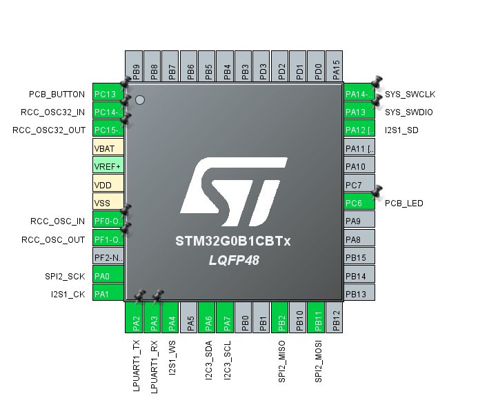

# STM32G0B1CBT6 評価F/W開発

## 開発環境

- マイコン: `STM32G0B1CBT6`
  - CPU: ARM Cortex-M0+
  - Clock: 64MHz
  - Flash: 128KB
  - SRAM: 144KB
- コンパイラ: Clang (`st-arm-clang 19.1.6`) 
  - 最適化: debug
- ツールチェイン
  - CMake
  - STM32CubeMX
  - STM32CubeIDE (VSCode版)
- デバッグ
  - デバッガ: `ST-LINK/V2-1`
    - デバッグI/F: SWD
  - printf()デバッグ
    - LPUART
      - TX: PA2ピン
      - RX: PA3ピン
      - 115200bps 8N1

## ピンアサイン



## メモリ使用量

- Lチカとprintf()のみでのメモリ使用量

```shell
[build] Memory region         Used Size  Region Size  %age Used
[build]              RAM:        2640 B       144 KB      1.79%
[build]            FLASH:       17272 B       128 KB     13.18%
```
